```{r setup, include=FALSE}
knitr::opts_chunk$set(echo = FALSE)
```

--- 

### Material

- The material for this lecture are hosted on GitHub:
  + <https://github.com/haghish/promenta>
- an example of and __organized project__ for running a simple CFA analysis and producing a dynamic document
- The current slides
- Rmarkdown template for creating PDF slides within RStudio


Overview
================================================================================

- Automatize the process of data analysis
  + organizing a computational project
  + reproduce the _entire_ analysis
- Automatize the process of reporting
  + producing a sensible analysis reports for a manuscript
    + dynamic tables, dynamic graphs, and dynamic text
  + discuss its necessity 

### Other important issues that are beyond this lecture
- Integrating version control 
- Pre-planned analysis
- Automating third-party statistics software such as __MPlus__ wihtin __R__ or __Stata__

-----


Statement of problem
====================

Garfield (1995) defines learning statistics as follows:

1. learning to communicate using statistical language
2. solving statistical problems
3. drawing conclusions
4. supporting conclusions with statistical reasoning

requires:

- in-depth understanding of statistical concepts
- statistical reasoning
- computer programming skills


---

- Statistics generally causes inconvenience for researchers of different fields (Baloglu, 2003)
- 80% of graduate students suffer from statistics anxiety (Onwuegbuzie, 2004)
  + math anxiety
  + computer anxiety
  + programming anxiety

---

- Proper statistical education has been _avoided_
  + Teaching through GUI instead of programming
    + SPSS, MPlus, AMUS, LISREL... gained popularity in social sciences
    + R and Python gained popularity in natural sciences
    + How about a 5-ECTS introductory R programming course for undergrads?
- The complexity of the methods is increasing annually
  + The journals' appetite for intricate statistics is growing 
- The gap between statistical education and statistical practice is increasing
- There is no statistical software that does __everything for everyone__
  + Particular analyses might be available in a special software

Problem?
========

We are lacking

- Basic coding education (no more mouse-and-click)
- Skills for planing and organizing data analysis
- Tracking our potential errors in different steps of research
- Communicating statistical decisions and reasons

Which results in lacking __reproduciblity__


---


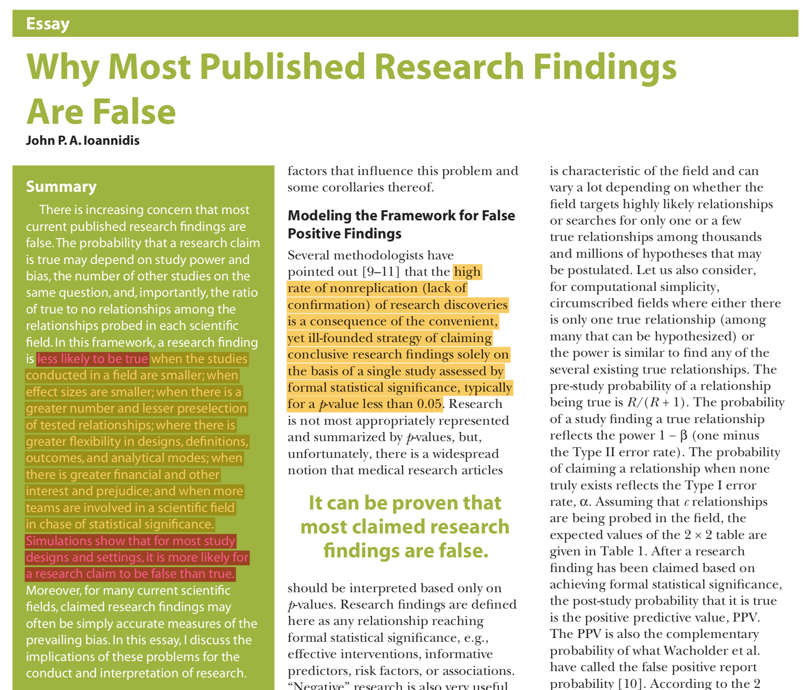

---


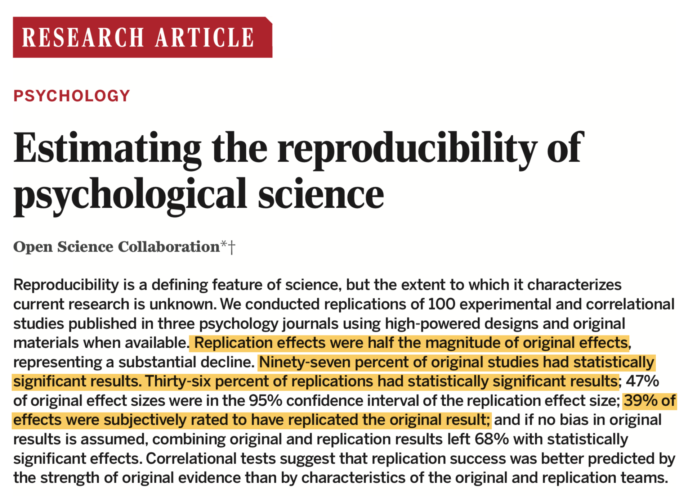


---

- Before jumping into a conclusion, it might be worth considering
  + How far statistical approaches to psychological research can go?
  + What are the limitations of statistical methods
  + Limitations of quantitative research?
  + ... 
  
---

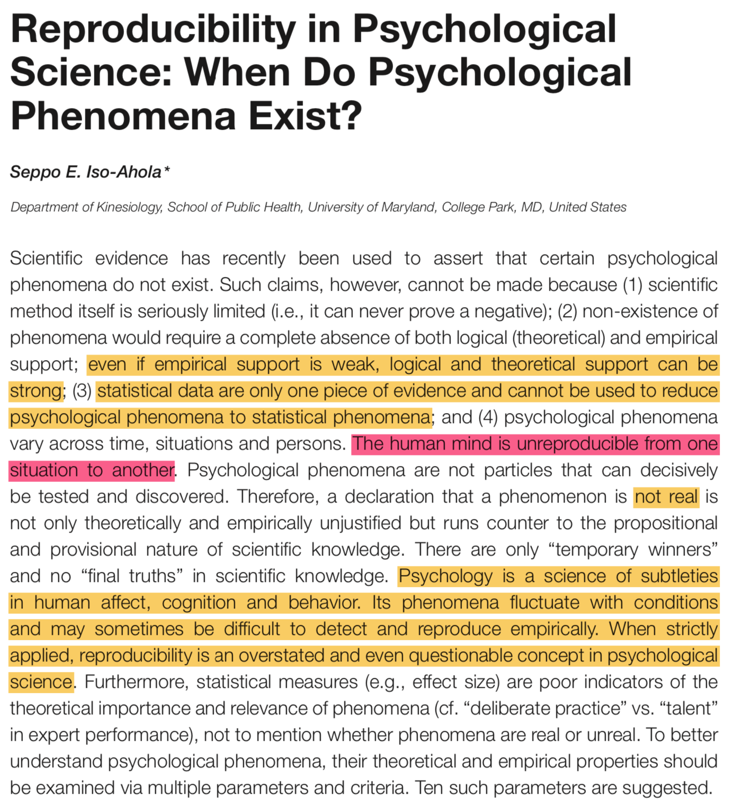

---


Reproducibility vs. Replication
===============================

- The two terms have been used interchangeably (Loscalzo, 2012)
- They have different meanings in different fields of science
- Replication requires re-implementing experiments by other research groups (Baggerly & Berry, 2009)
  + using either the same methodology or alternatives 
- Problems with replication?
	
Reproducibility
===============

- Baggerly & Berry (2009):
  + reproducibility is replicating the computation by an independent researcher
    + using the same data, programmed code, procedure, and methodology
    + and without requiring any further assistance or information from the author (King, 1995)
  + the least standard for evaluating the quantitative results
  + reproducibility does not guarantee (Peng, 2011; Stodden, et. al., 2014):
    + quality
    + sound methodology
    + accurate data collection
    + validity of the findings
- reproducibility grants limited transparency (Gentleman & Lang, 2012)
  + validate the computational procedure
  + check or adapt the claims in the scientific publication


Sources of error in research
============================

- Errors can happen at any stage of research
  + study design
  + data collection
  + digitizing the data from questionnaires to a computer
  + cleaning the data
  + preparing the data for analysis
  + choice of methodology
    + adjustment options, analytical assumptions, algorithms, etc...
  + interpreting the results
  + reporting the results in the publication
    + copy-pasting from statistical software to MS Word 
    + any problem with that?
  + ... 
- Or afterwards, such as publication bias, etc...

Collaboration on computational research
=======================================

- The majority of statistical contributions do not appear in the manuscripts
  + no code, no data checking, no quality assurance, ... 
- Lacking reproducibility means no collaboration on statistical analyses
- Collaboration on statistical analysis is like collaboration on software:
  + well-structured
  + automatized
  + well-documented
  + dependencies are carefully planned, organized, documented

Costs
==========

- You need to learn new tricks and let go of old habits
- No one gives you credit for being transparent
- Transparency means your mistakes can be revealed by others
  + Shame or gratitude? 
  + What you cannot reproduce your own analysis?
  + How would you feel about sharing your code?
- Reproducibility is human problem, not computers

Automated Data Analysis
================================================================================

- Automated data analysis means making data analysis reproducible
  + writing analysis code to track __the entire data analysis__
  + setup and organize your analytic project
    + Operating system and statistical software 
    + Add-on packages
  + Data management
  + Nesting analysis code (and why should you)
  + Communicating the analysis
  
---


Organizing the computation
==========================

- The rule is to be disciplined, __very disciplined__
  + Keep track of changes in code, data, and analysis results
- There is no template to be applicable to all projects
  + with different types of data, there will be different procedures and workflows
- Rule of thumb:
  + protect your raw data
  + keep track of all the code for preparing the data for analysis
  + keep track of all the analysis code
  + create seperate directories for storing raw data, code, analysis results/reports, documents, etc.

---

### Example 1: R package


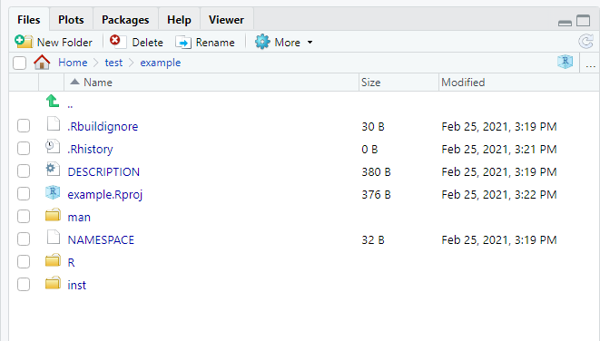

---

### Example 2: UiN Project


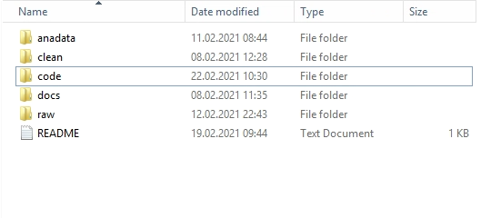


--- 

### Example 3: My personal preference


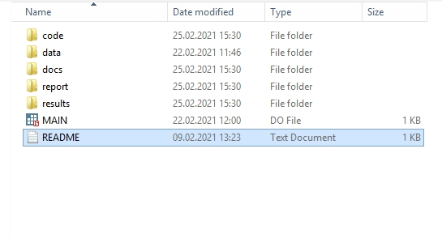


--- 

### Example of a README file


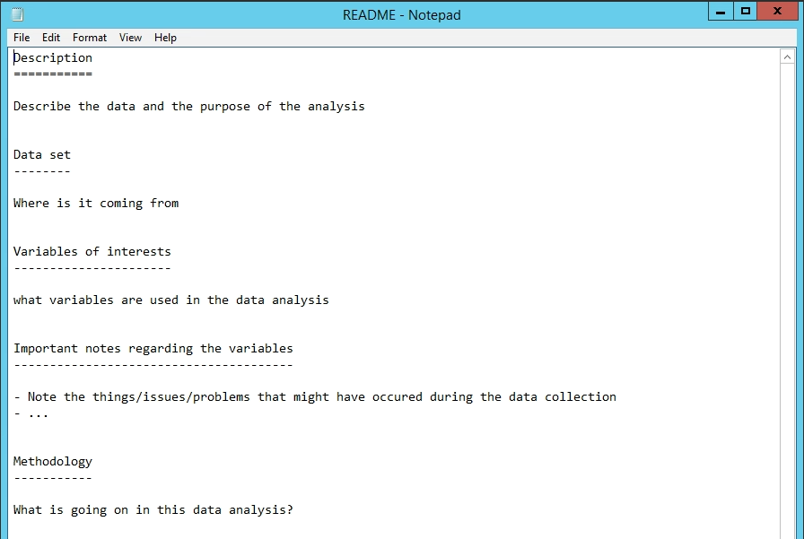


Nesting script files
====================

- The idea is borrowed from computer science
  + For example, see how Linux kernel is compiled
  + see the __Makefile__ in <https://github.com/torvalds/linux>
  + the file provides all of the orders to compile Linux from the source code
- We apply the same discipline to approach reproducibility
  + There will be a single file that provides the instructions to rerun the entire data analysis
    + I name that file __MAIN__, you name it ...
    + the file will source all other script files used for preparing, analyzing, and reporting the analysis
- Nesting works best with reletive file paths (instead of absolute paths)
  + begin the __MAIN__ file by setting the working directory:
    + Use __`setwd()`__ in __R__, __`cd`__ in __Stata__ and __SPSS__ 

--- 


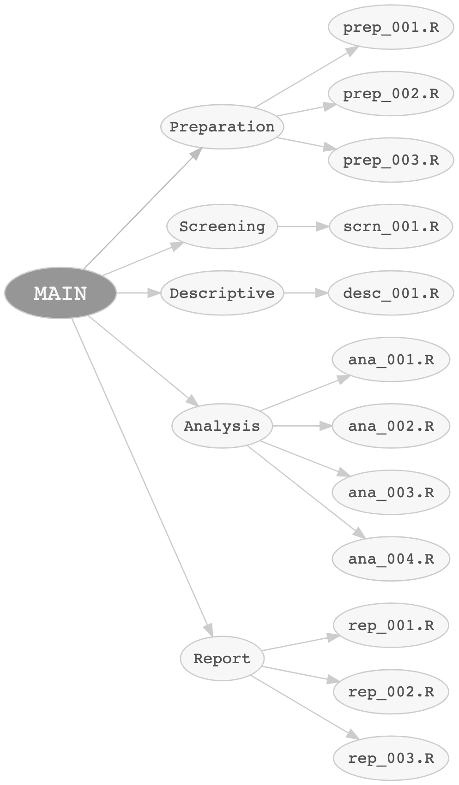

Nesting script files
====================

### R

```
source('./code/preparation/prep_001.R')
```

### Stata

```
do './code/preparation/prep_001.do'
```

### SPSS

```
INSERT FILE='./code/preparation/prep_001.sps'. 
```


Notes: general suggestions
==========================

\scriptsize

1. The raw data is kept untouched
  + Store time-consuming operations in a different directory (e.g. _anadata_)
2. Organize your code under subdirectories (if you write many files?)
3. Save the results (analysis outputs) in seperate directories and name them properly within the code
4. Name and document your data file, especially if it is going to receive further updates in the future
5. Document the software dependencies (Operating system, R/Stata/etc. version, __ALL add-on packages'__ versions)
  + check for example __`lavaan`__ change history: <https://lavaan.ugent.be/history/>
6. Document the data set
  + use `datadoc` (Haghish, 2020) command for __Stata__ or `Rd documentation` from __RStudio__


Notes: data documentation
=========================

- CRAN recommends the following documentation section for a data set
  1. Title, the label of the dataset, and where it was published (package name)
  2. Description
  3. Format, including a table summarizing the variables’ types and labels
  4. Notes attached to the dataset or the variables (for Stata only)
  5. The source of the data; that is, where they are coming from
  6. References, if any
  7. Examples, if needed
  
--- 


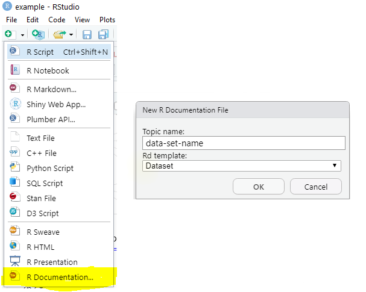


Automated Analysis Reporting
================================================================================


Avoiding manual reporting
=========================

I noted that errors can happen in the process of reporting

### Sources of error in research

- Errors are everyday and can happen at any stage of research
  + ...
  + interpreting the results
  + reporting the results in the publication
    + copy-paste from statistical software to MS Word
    + updating the report after making a change in the data or analysis
  + ...


Avoiding manual reporting
=========================

- A solution is to do the data analysis and write the analysis report at the same time
- This is a paradigm borrowed from computer science, for solving software documentation problem
  + documentation is written within code files using special comment signs
  + next, a program extracts and renders the documentation and updates the documents (Knuth 1983)
- There are software for generating data analysis reports:
  + for __R__, use __`rmarkdown`__ (Yihui, et. al., 2018)
  + for __Stata__, use __`markdoc`__ (haghish, 2016)
  + for __SPSS__, no _equivalent_ exists, although `StatTag` offers adding dynamic values from SPSS
    + __StatTag__ is not recommended because it does not provide any insight about the reproducibility
  + both provide a restricted framework to examine the reproducibility of the code


`rmarkdown` package
===================

- `rmarkdown` is a general purpose literate programming software
- developed particularly for R
- `rmarkdown` is versatile:
    + generate publication-ready analysis report in various document formats (PDF, Docx, ODT, HTML, LaTeX, etc.)
	+ includes a syntax highlighter
    + generate dynamic presentation slides
    + generate dynamic R help files and package vignette
- Analysis documentation/interpretation is written within _Rmd_ files

Who can use `rmarkdown`?
========================

1. Students - as early as introductory statistics courses - can use `rmarkdown` to actively take note inside RStudio

2. University lecturers who teach statistics using R, can use `rmarkdown` to generate PDF slides, educational materials

3. Statisticians can use `rmarkdown` for creating dynamic analysis reports

4. Researchers can use it to create publication-ready Microsoft Word or LaTeX documents


---

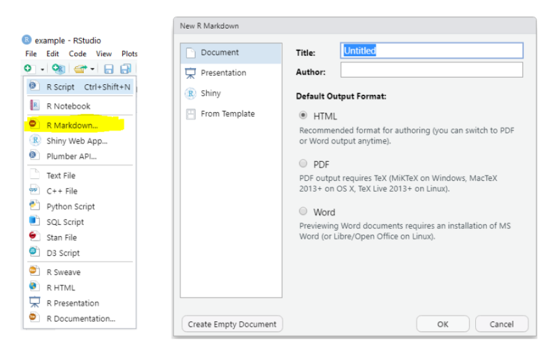


Supported Markup Languages
==========================

- `rmarkdown` supports several languages such as __Markdown__, __LaTeX__, and __HTML__

- In this lecture we will focus on Markdown, which is the simplest. The following links, from its developer's site, can provide a good background about Markdown:
	- <https://daringfireball.net/projects/markdown/>
	- <https://daringfireball.net/projects/markdown/syntax>
	- <https://daringfireball.net/projects/markdown/dingus>

- Markdown is: 
  + minimalistic and clean 
  + simple to read and write
  + helps to focus on the content
  + can be converted to many formats

---

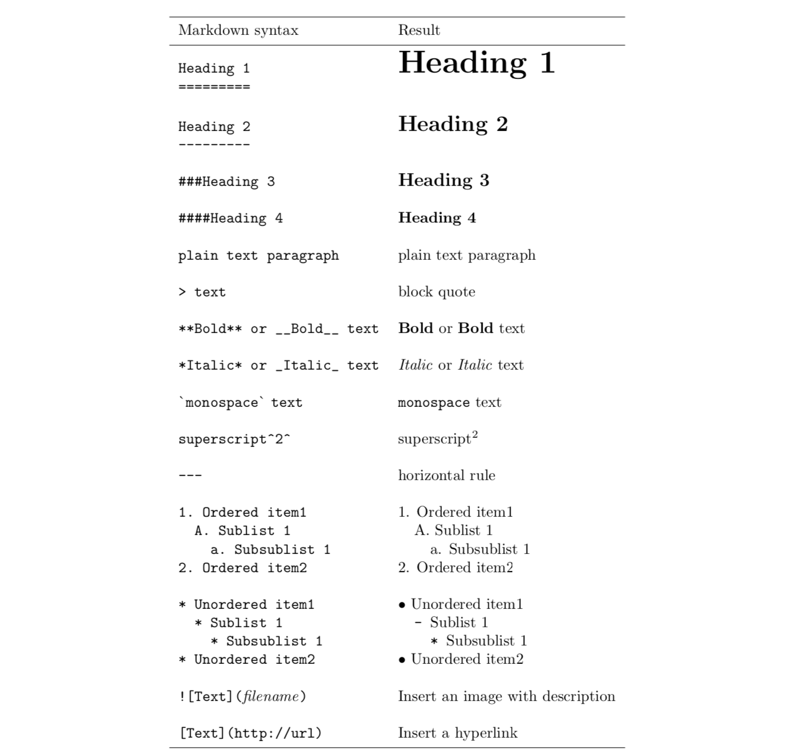

Planning the analysis report
============================

- __R__ script files have an __`.r`__ extension, `rmarkdown` files have __`.rmd`__ extension
- Human language and computer languages are separated from one another
- You can nest the analysis into multiple Rmd files
- You have __full control__ about what to include or exclude in your document
  + dynamic text
  + R code
  + R output
  + graphs
  + tables
  + mathematical notations

---

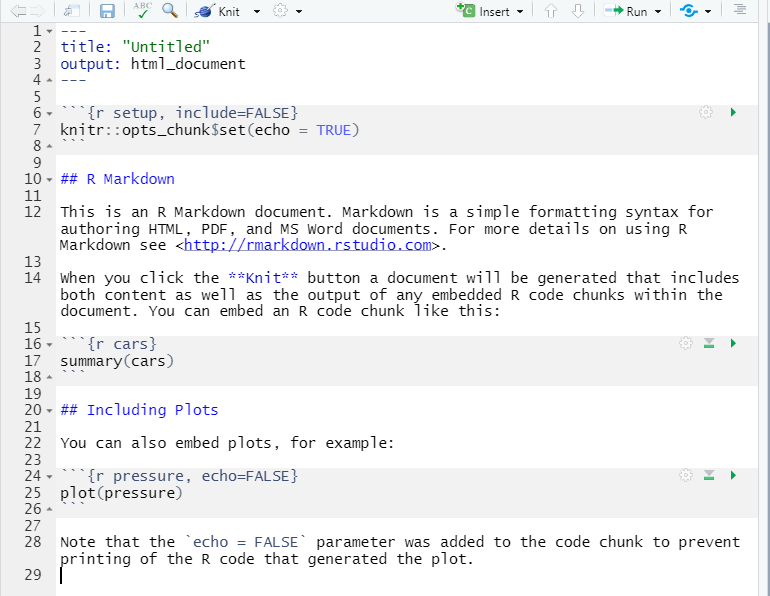

--- 

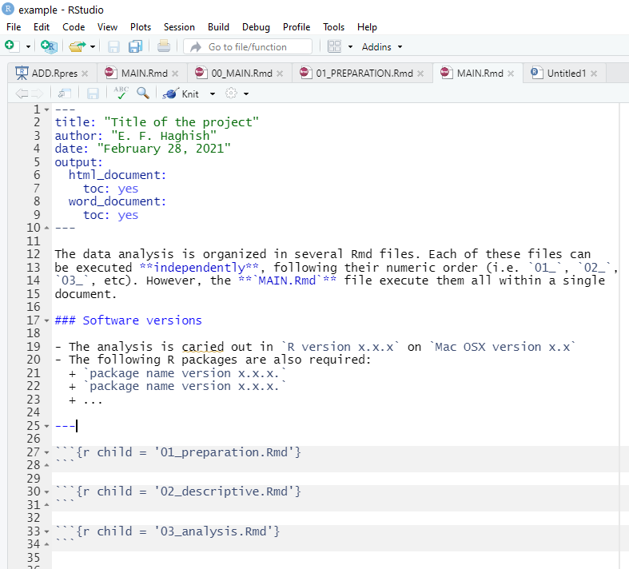


Dynamic tables
==============

- __markdown__ language offers syntax for creating tables, but it is tedious <https://pandoc.org/MANUAL.html#Tables>
- we can create tables by constructing a string matrix and converting it to a table
- consider the output document before designing your table:
  + for MS Word use __markdown__ only
  + for LaTeX and HTML you have plenty of option
- For general purpose, I recommend __`pander`__ 
  + for different _classess_, __`pander`__ offers automated table designs


References
========================================================

\scriptsize

- Garfield, J. (1995). How students learn statistics. International Statistical Review / Revue Internationale de Statistique, 63 (1), 25-34. Retrieved from http://www.jstor.org/stable/1403775

- Baloglu, M. (2003). Individual differences in statistics anxiety among college students. 
Personality and Individual Differences, 34 (5), 855-865.

- Onwuegbuzie, A. J. (2004). Academic procrastination and statistics anxiety. Assessment & Evaluation in Higher Education, 29 (1), 3-19.

- Loscalzo, J. (2012). Irreproducible experimental results: Causes, (mis)interpretations,
and consequences. Circulation, 125 (10), 1211-1214. Retrieved from
http://circ.ahajournals.org/content/125/10/1211.short doi: 10.1161/CIRCULATIONAHA.112.098244

- Baggerly, K. A., & Berry, D. A. (2009). Reproducible research.

- Peng, R. D. (2011). Reproducible research in computational science. Science (New
York, Ny), 334 (6060), 1226.

- Stodden, V., Leisch, F., & Peng, R. D. (2014). Implementing reproducible research. CRC Press.

- Gentleman, R., & Lang, D. T. (2012). Statistical analyses and reproducible research. Journal of Computational and Graphical Statistics.

---

\scriptsize

- Knuth, D. E. 1983. The WEB system of structured documentation. Technical Report
STAN-CS-83-980, Department of Computer Science, Stanford University. http: //
infolab.stanford.edu / pub / cstr / reports / cs / tr / 83 / 980 /CS-TR-83-980.pd

- Xie, Yihui, Joseph J. Allaire, and Garrett Grolemund (2018). R markdown: The definitive guide. CRC Press.

- Haghish E. F. (2016). Markdoc: Literate Programming in Stata. The Stata Journal, 16(4):964-988. doi:10.1177/1536867X1601600409

- Haghish, E. F. (2020). Software documentation with markdoc 5.0. The Stata Journal, 20(2), 336-362.

- Open Science Collaboration. (2015). Estimating the reproducibility of psychological science. Science, 349(6251).

- Iso-Ahola, S. E. (2017). Reproducibility in psychological science: When do psychological phenomena exist?. Frontiers in Psychology, 8, 879.


---

\scriptsize

- Ioannidis, J. P. (2005). Why most published research findings are false. PLoS medicine, 2(8), e124.

- Zunger, J. (2018). Computer science faces an ethics crisis. The Cambridge Analytica scandal proves it. Boston Globe, 22.
